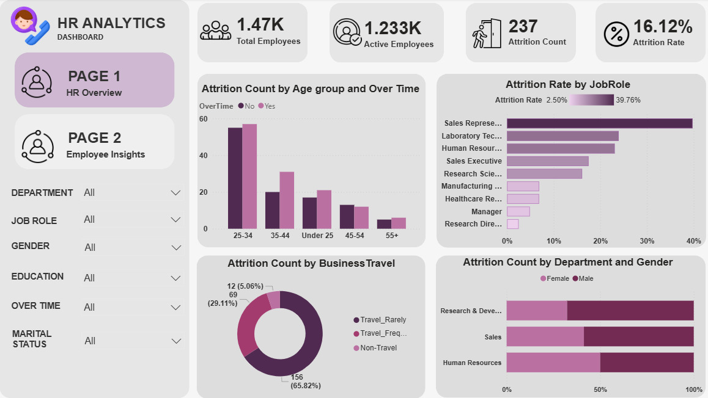
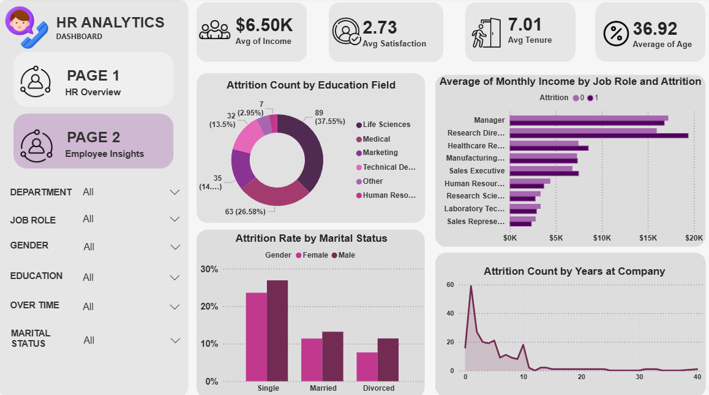

# CodeAlpha_hr_analytics_dashboard
Data-driven HR Analytics Dashboard built with Power BI &amp; DAX to uncover workforce attrition patterns and provide strategic retention recommendations.
# 📊 HR Analytics Dashboard

## 📌 Project Overview
This repository contains an end-to-end, production-grade **2-Page Power BI HR Analytics Dashboard** built during the remote internship at **CodeAlpha**. It evaluates key workforce dynamics, turnover risks, department vulnerability, and employee engagement metrics.

The primary objective of this project is to transform raw HR records into a **data-driven business story**, pinpointing the root causes behind employee turnover (**Attrition Rate: 16.12%**) and offering targeted, strategic recommendations for executive leadership to boost long-term retention.

---

## 🛠️ Tech Stack & Key Skills
* **BI Platform:** Power BI Desktop
* **Data Transformation:** Power Query (ETL, Data Cleaning, Custom Binning for Age Groups)
* **Data Modeling & Calculations:** DAX (Data Analysis Expressions) for custom KPI measures
* **Features Used:** Synced Slicers, Custom Page Navigation, Custom Color Palette (`#582C58` Theme), Native KPI Cards, Interactive Cross-Filtering.
* **Analysis Concepts:** HR Analytics, Employee Churn Analysis, Retention Strategy, Compensation & Workload Profiling.

---

## 📖 The Business Narrative (Storytelling & Insights)

### 👥 Chapter 1: HR Overview (Workforce Baseline & Attrition Dynamics)
* **Performance Baseline:** Analyzed an organization of **1,470 total employees**, maintaining **1,233 active staff** with an average age of **36.92 years** and an average tenure of **7.01 years**.
* **Attrition Baseline:** Logged a total of **237 employee departures**, resulting in an overall **Attrition Rate of 16.12%**.
* **Departmental Concentration & Overtime Triggers:**
  * **Sales Department Concentration:** Attrition is heavily concentrated in the **Sales** department. The turnover rate for the top position in Sales (**Sales Representative at 39.76%**) drastically outpaces all other job roles.
  * **Gender & Overtime Dynamics:** Female departures in Sales are significantly driven by high **OverTime** workloads. Conversely, male departures in **Research & Development** are strongly linked to excessive overtime. Overtime stands out as a critical cross-departmental turnover trigger.
* **Travel Frequency Insights:**
  * Employees who travel rarely (**Travel_Rarely**) account for **66.17%** of total resignations. This confirms that travel fatigue is not the core issue, pointing instead to internal workload stress and compensation gaps.



### 💼 Chapter 2: Employee Insights (Compensation & Demographics Risk)
* **Marital Status & High-Risk Demographics:**
  * Single employees exhibit a significantly higher turnover rate compared to married or divorced peers (**~26% for Single Males**, **~23% for Single Females**). Younger, unattached talent shows higher mobility and lower long-term retention.
* **Compensation vs. Job Role Risk:**
  * An inverse relationship exists between monthly income and attrition. Executive roles (**Managers**, **Research Directors**) earning **$15K–$20K** experience near-zero turnover (<5%). 
  * Entry-level and lower-income roles (**Sales Representatives**, **Laboratory Technicians**) suffer severe turnover due to income disparity and target pressures.
* **Tenure Vulnerability (First-Year Onboarding Gap):**
  * Resignations peak sharply during the **first 12 months** (approx. 60 departures at Year 1) and decline steeply after 3 years. This indicates a major gap in the company's early-stage onboarding and role-adaptation framework.
* **Education Field Impact:** Over **64%** of departing workforce hold degrees in **Life Sciences (37.55%)** and **Medical (26.58%)**.



---

## 💻 Technical Implementation, DAX & Data Engineering

To ensure high performance and precise dynamic aggregations, custom **DAX measures** and **Power Query transformations** were built.

### 📐 Key DAX Measures & Calculated Columns

#### 1. Attrition Rate Measure
Calculates the exact percentage of employees who have left the company relative to the total headcount:
```dax
Attrition Rate = 
DIVIDE(
    [Attrition Count], 
    [Total Employees], 
    0
)
```
#### 2. Active Employees Count
Dynamically computes the remaining workforce currently active in the organization:
```dax
Active Employees = 
CALCULATE(
    COUNT('HR_Data'[EmployeeNumber]), 
    'HR_Data'[Attrition] = "No"
)
```
#### 3. Average Monthly Income
Used to evaluate compensation baselines across different job roles and department hierarchies:
```dax
Avg Monthly Income = AVERAGE('HR_Data'[MonthlyIncome])
```
#### 4. Average Job Satisfaction Score
Evaluates the organizational satisfaction metric on a 1–4 standardized scale:
```dax
Avg Job Satisfaction = AVERAGE('HR_Data'[JobSatisfaction])
```
## 📦 Data Grouping & Transformation (Power Query)

  Age Demographic Binning: Transformed continuous age data into structured age brackets (Under 25, 25-34, 35-44, 45-54, 55+) to isolate generational turnover trends.

  Conditional Formatting & Page Navigation: Configured interactive page navigation buttons with active (Selected) and passive state color transitions to deliver an intuitive user experience.

## 💡 Strategic Recommendations for Executive Leadership

1. **Overtime Restructuring:** Audit and re-distribute workloads in the **Sales** (impactful for female retention) and **R&D** (impactful for male retention) departments to reduce overtime-induced burnout.
2. **Sales Rep Compensation & Career Pathing:** Overhaul base pay structures and performance bonuses for *Sales Representatives* to combat the critical **39.76%** turnover rate.
3. **Targeted Single Employee Engagement:** Develop tailored career development plans and retention initiatives targeting high-risk sub-segments, specifically young, single professionals.
4. **Structured First-Year Onboarding:** Implement a structured 30-60-90 day onboarding and mentorship framework to reduce the massive 1st-year departure spike.
